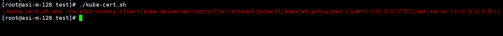
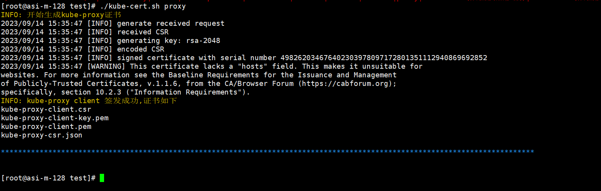

# kube-certifi 自定义签发k8s证书

### 脚本使用

```
#输出所有可用参数
bash kube-certifi
```

### 文件介绍

```
#执行bash kube-certifi文件会自动创建

etcd.txt -> 存放etcd的证书签发ip和域名
apiserver.txt -> 存放api-server的证书签发ip和域名
kubelet.txt -> 存放kubelet的证书签发ip和域名
coutom.txt -> 存放自定义的证书签发ip和域名
```




